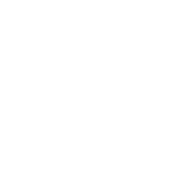

### Hi there, I'm nsbgg 👋

💻 I'm currently training as an **Application Developer** in Germany, and I've already sold a few websites on the side.  
🌱 I love building projects that solve problems or bring ideas to life.  
🌍 I speak both  **German** and  **English**.

---

### 🛠️ Tech Stack

#### 🧑‍💻 Languages & Programming

  &nbsp;
  &nbsp;
  &nbsp;
  &nbsp;
  &nbsp;
  &nbsp;
  &nbsp;
  &nbsp;
  
  

#### ⚙️ Tools

  &nbsp;
  &nbsp;
  &nbsp;
  

#### 🧠 Technologies I work with

  &nbsp;
  &nbsp;
  &nbsp;
  
  

---

### 🚧 Projects in Progress

🍲 I'm currently working on a **private recipe website** where users can share and browse meals.  
🔗 You can also check out one of my recent projects here:  
👉 [nsbgg.github.io](https://nsbgg.github.io)

---

### 🎯 Why I Code

I enjoy creating things from scratch and giving form to a problem or a vision – turning it into a working solution.

---

### ✨ Outside of Code

📸 I love **photography**, enjoy **gaming**, and always look forward to the next **trip abroad**.  
Whether it's capturing the moment or exploring a new world (virtual or real), I’m all in.

---

> Built with passion and curiosity.  
> –  nsbgg
